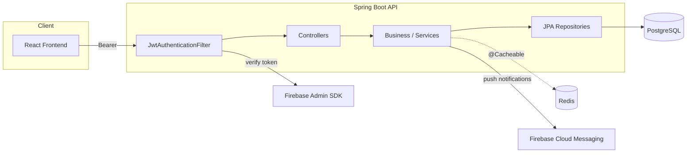
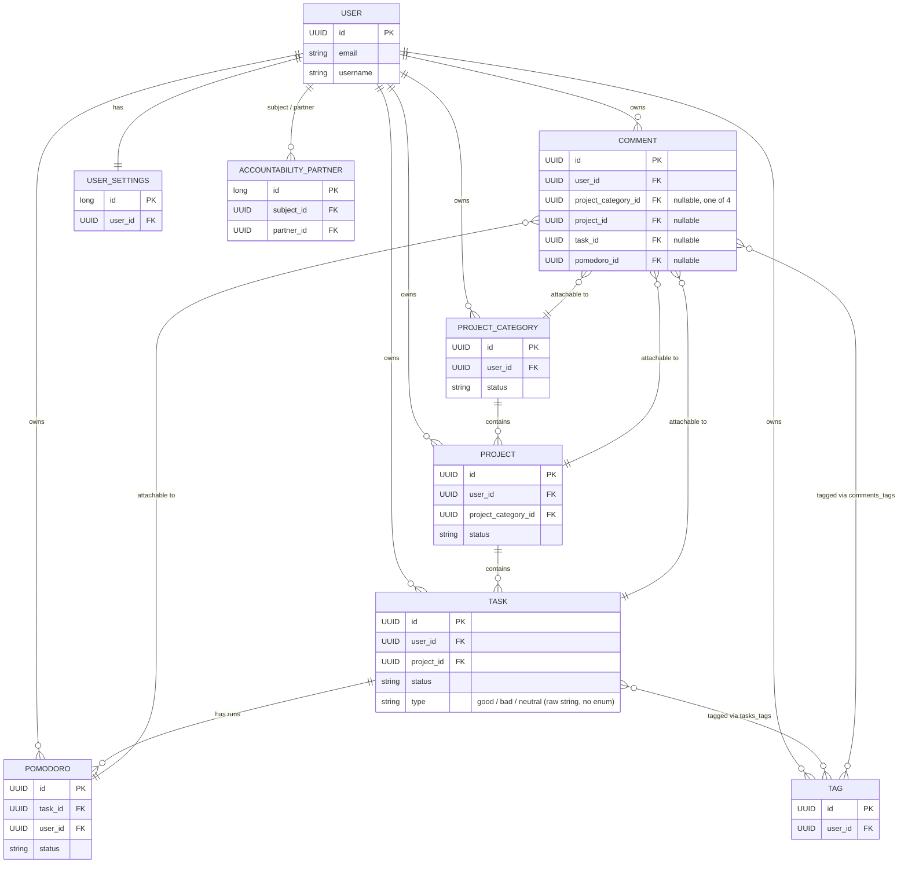
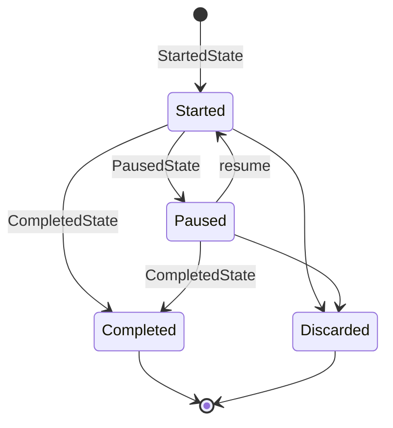
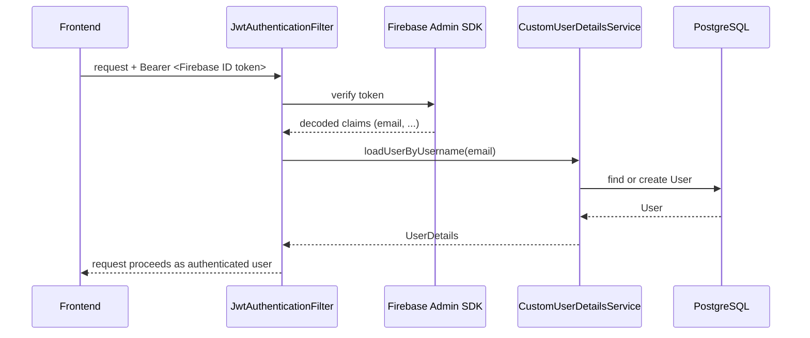

# Architecture — Habits Pomodoro (Backend)

Spring Boot 3 / Java 17 API for the Habits Pomodoro app. See the [root README](../README.md) for the product concept. This document describes how the code is actually organized today, including known inconsistencies, so it can serve as a map for refactoring — not an idealized target state.

## Stack

- **Java 17**, Spring Boot 3.0.1
- **PostgreSQL** — primary datastore (Spring Data JPA / Hibernate)
- **Redis** — response/query caching (`@Cacheable`, partially wired — see [Known gaps](#known-gaps))
- **Firebase Admin SDK** — verifies ID tokens issued by the frontend's Firebase Auth; also used for push notifications (FCM)
- **springdoc-openapi** — Swagger UI for the REST API

## Layering

```
Controller  →  Business (service)  →  JPA (repository)  →  Model (entity)
```

Each domain concept generally gets one class per layer, e.g. `TaskController` → `TaskService` → `TaskRepository` → `Task`. This holds for Task, Project, ProjectCategory, Tag, Pomodoro, AccountabilityPartner, User, and UserSettings.

**Exception:** `CommentController` has no `CommentService`. It calls seven repositories directly (`UserRepository`, `ProjectCategoryRepository`, `ProjectRepository`, `TaskRepository`, `PomodoroRepository`, `CommentRepository`, `TagRepository`) and does entity lookups, validation, and relation-wiring inline. Extracting a `CommentService` is the natural first step before adding comment features.



## Domain model



Notes:
- `Comment` attaches to exactly one of ProjectCategory / Project / Task / Pomodoro via nullable FKs rather than a polymorphic/discriminator design.
- Most entities use `UUID` primary keys (post-migration from `Long`). `AccountabilityPartner` and `UserSettings` still use auto-generated `Long` ids — not wrong, just inconsistent, and worth knowing if you're writing generic code against "the" id type.
- `Task.status`, `Task.type`, `Pomodoro.status`, `Project.status`, `Comment.status` are all raw `String` with only comment documentation of valid values (e.g. "started, paused, completed, discarded"). No enum, no DB constraint.

## Pomodoro state machine

`Pomodoro`/`RunningPomodoro` transitions are modeled as a state pattern:



`PomodoroState` is the interface; `StartedState`, `PausedState`, `CompletedState` implement per-status elapsed-time math. `RunningPomodoro` holds the in-progress pomodoro and delegates to the current state.

## Authentication & authorization



- All endpoints require authentication except `/manage/**` and `OPTIONS` preflight (`JwtSecurityConfiguration`).
- There is no method-level `@PreAuthorize` — every "is this record mine" check is done by hand inside services/repositories (queries scoped by `userId`). This is consistent today but means a missing `userId` filter in any new query is a direct IDOR risk.
- `BasicAuthSecurityConfiguration` exists but is disabled (`@Configuration` commented out) — dead code from an earlier auth approach, left in the codebase.
- **Accountability partners** let one user (`subject`) share their data with another (`partner`). Currently `AccountabilityPartnerController.createPartner` lets any user attach any other existing account by email with no consent step, and the 404-vs-409 response difference leaks whether an email has an account. See [Known gaps](#known-gaps).

## Caching

Redis-backed `@Cacheable`/`@CacheEvict` is used on a handful of services (`UserService`, `AuthorityService`) but is inconsistent — mid-refactor at the time of writing:
- `ProjectCategoryService` has all cache annotations commented out rather than removed.
- `AuthorityService.getAuthorities` caches by `User` argument, but `User` has no `equals`/`hashCode`, so it effectively never hits cache.
- `UserService.updatePassword` saves without evicting the `user` cache — a stale cached user (with old password) can be served after a password change.

## Known gaps

These were found during a code audit (2026-08) and are candidates for near-term fixes rather than aspirational design:

1. **Likely runtime bugs from the UUID migration:** `CommentRepository`'s list queries (`retrieveUserComments`, `retrieveUserCommentsWithReviseDate`, `retrieveUserSearchedComments`) take `long[] categoryIds` while their sibling *count* queries correctly take `UUID[]`. `PomodoroRepository.getTaskPomodorosCount(Long, Long)` similarly still takes `Long taskId` where every sibling method takes `UUID taskId`.
2. `TaskRepository`, `PomodoroRepository`, `TagRepository`, `ProjectCategoryRepository` still declare `extends JpaRepository<Entity, Long>` despite `UUID` entity ids.
3. No `CommentService` — logic lives directly in `CommentController`.
4. Zero test coverage on `StatsService`, `TagService`, `AccountabilityPartnerService` (authorization-sensitive), and the entire `security/` package.
5. Accountability-partner creation has no invite/accept step and leaks account existence via email lookup.
6. No Flyway/Liquibase — schema changes are applied via hand-run SQL scripts in `src/main/resources` (e.g. `psql_uuid_migration_steps.sql`), and `spring.jpa.hibernate.ddl-auto=update` has no profile separation from a hypothetical prod config.
7. Spring Boot 3.0.1 is EOL.

## Package map

```
com.anshul.atomichabits/
├── controller/     REST endpoints, request/response mapping, auth-context extraction
├── business/       Service layer — domain logic, orchestration, caching
├── jpa/             Spring Data repositories (queries, native SQL for stats)
├── model/           JPA entities
├── dto/             Request/response payloads
├── security/        JWT filter, Firebase config, user details service, signup
├── exceptions/      Custom exceptions + global handler
└── aop/             Cross-cutting concerns (logging/timing aspects)
```
