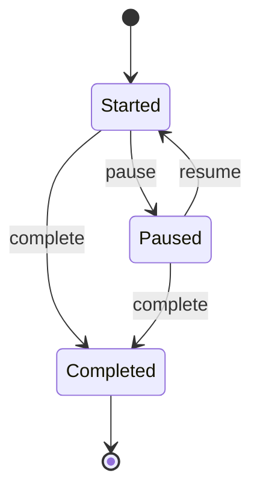

# Pomodoro Timer

## What it does

The core interaction loop: start a pomodoro timer against a task, pause/resume it, complete it, or log one that already happened ("add past pomodoro if missed to start" per the README). Each completed pomodoro is what all stats/streaks are computed from.

## Backend

**Entity:** `Pomodoro` (`habits-pomodoro/src/main/java/com/anshul/atomichabits/model/Pomodoro.java`)

| Field | Type | Notes |
|---|---|---|
| `id` | `UUID` | |
| `startTime`, `endTime` | `OffsetDateTime` | |
| `length` | `Integer` | minutes, default 25 |
| `timeElapsed` | `Integer` | seconds elapsed, updated as the timer runs |
| `status` | `String` | `started` / `paused` / `completed` (also `discarded` per code comments) — raw string |
| `task` | `Task` | `@ManyToOne`, lazy |
| `user` | `User` | `@ManyToOne`, lazy |

**State machine:** `RunningPomodoro` (`business/RunningPomodoro.java`) wraps a `Pomodoro` and delegates status transitions to one of `StartedState` / `PausedState` / `CompletedState` (all implement `PomodoroState`), each handling its own elapsed-time math.

**Service:** `PomodoroService` (`business/PomodoroService.java`) — also home to `getRunningPomodoro`, which has a known bug (see below).

**Endpoints:** `PomodoroController` (`controller/PomodoroController.java`)

| Method | Path | Purpose |
|---|---|---|
| GET | `/pomodoros` | list, filterable |
| GET | `/pomodoros/running` | the currently in-progress pomodoro, if any |
| POST | `/pomodoros` | start a new pomodoro |
| POST | `/pomodoros/past` | log a completed pomodoro after the fact |
| PUT | `/pomodoros/{id}` | update status/elapsed time (pause/resume/complete) |
| DELETE | `/pomodoros/{id}` | discard |

(Stats-related endpoints also live on `PomodoroController` — see [Stats](06-stats.md).)

## Frontend

**Components:** `src/components/features/pomodoros/`
- `PomodoroComponent.jsx` — the running timer UI
- `StopwatchComponent.jsx` — alternate stopwatch-style display (`enableStopwatch` user setting)
- `BreakTimerComponent.jsx` — break countdown after a completed pomodoro

Past-pomodoro entry lives with Tasks: `src/components/features/tasks/PastPomodoroComponent.jsx`.

**Data flow:** Unlike Tasks/Projects/Categories/Tags/Comments, Pomodoros are **not** routed through the generic `dbConfig.js` sync map — `PomodoroApiService.js` is called more directly for creates/updates (e.g. `createPomodoroApi` invoked straight from `ListTasksComponent.jsx`), reflecting that a running timer needs immediate server truth rather than eventual offline sync. `todaysPomodoros` is still exposed as a live Dexie query via `DataContext.jsx` for today's-progress display.

## Known gaps

- **`PomodoroService.getRunningPomodoro`** compares status with `==` instead of `.equals()` (`if (runningPomodoro.getPomodoro().getStatus() == "completed")`) — works today only because the string is set via `setStatus("completed")` earlier in the same call (interned literal); fragile if that code path changes.
- **Sound effects likely broken:** `BreakTimerComponent.jsx` and `PomodoroComponent.jsx` reference `import.meta.env.PUBLIC_URL`, a Create React App convention Vite doesn't populate — the completion/tick audio probably resolves to a broken path since the Vite migration.
- No direct tests for `StartedState`/`PausedState`/`CompletedState` transition edge cases — only reached indirectly via `RunningPomodoroTest`.
- `Pomodoro.status` is a raw string, same enum gap as `Task`/`Project`.
