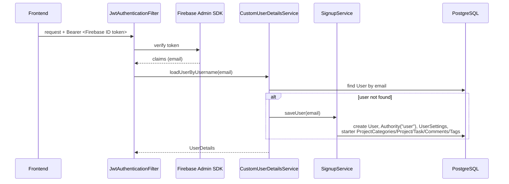

# Auth & User Settings

## What it does

Login/signup via Firebase Auth, with the backend auto-provisioning a `User` (plus starter data) on a new account's first authenticated request — there's no explicit backend signup endpoint. Per-user preferences (pomodoro/break length, chart defaults, pagination sizes, notifications) live in `UserSettings`.

## Backend

### Auth

No dedicated `AuthController` — Firebase issues and manages the credential; the backend only verifies it and auto-provisions.

**`SignupService.saveUser`** (`security/SignupService.java`) seeds a new account with: an `Authority` of `"user"`, default `UserSettings`, four starter `ProjectCategory` rows (General, Health, Hobbies, Rest — the last with `visibleToPartners=false`), one starter `Project`, one starter `Task`, four starter `Comment`s (including a markdown-formatted example), and two starter `Tag`s (`daily`, `imp`). This is what a brand-new user sees on first login.

**Security config:** `JwtSecurityConfiguration` (`security/`) requires auth on everything except `/manage/**` and CORS preflight; `/users` additionally requires the `admin` authority via `@PreAuthorize` (the only method-level authorization check in the codebase — every other endpoint relies on manual `userId`-scoped queries). `BasicAuthSecurityConfiguration` also exists but is disabled (commented-out `@Configuration`) — legacy, unused.

**Notifications:** `NotificationConfig` wires Firebase Cloud Messaging server-side; `Task.enableNotifications` / `UserSettings.enableNotifications` gate whether a given task/user receives pushes.

### User Settings

**Entity:** `UserSettings` (`model/UserSettings.java`) — `Long` id (not migrated to `UUID`, see [Accountability Partners](07-accountability-partners.md) for the other exception), `@OneToOne` with `User`. Fields split into three groups:
- **Timer defaults:** `pomodoroLength` (25), `breakLength` (5), `enableStopwatch`, `enableStopwatchAudio`, `enableAutoStartBreak`, `enableAutoTimerFullscreen`
- **Chart preferences:** `enableChartScale`/`chartScale`, `enableChartWeeklyAverage`/`chartWeeklyAverage`, monthly/yearly equivalents, `enableChartAdjustedWeeklyMonthlyAverage`, `tasksChartType`/`projectsChartType`/`projectCategoriesChartType`, `defaultStatsLimit`, `homePageDefaultList`, `homePageChart`
- **Pagination:** `pageProjectsCount`, `pageTasksCount`, `pageCommentsCount` (all default 5)
- `enableNotifications` — global notification toggle

**Service:** `UserSettingsService` (`business/`)

**Endpoints:** `UserSettingsController`

| Method | Path |
|---|---|
| GET | `/user-settings` |
| PUT | `/user-settings` |

## Frontend

**Auth components/services:**
- `src/components/LoginComponent.jsx`, `SignupComponent.jsx`, `ForgotPasswordComponent.jsx`
- `src/services/auth/FirebaseAuthService.js` — thin wrapper over Firebase Auth SDK calls (login/signup/refresh/reset)
- `src/services/auth/AuthContext.jsx` — the app-wide auth context; also owns the axios request/response interceptor (token attach + refresh + 401→logout) and the periodic Dexie sync scheduling (see [frontend ARCHITECTURE.md](../../habits-pomodoro-frontend/ARCHITECTURE.md#state-management))
- `src/services/FirebaseMessageService.jsx` — requests/stores the FCM token (`getAndStoreNotificationsToken`)
- `src/services/FirebaseFirestoreService.js` — `disableToken`, called on logout
- `src/firebase-messaging-sw.js` — service worker for background push

**Settings components:** `src/components/user-settings/`
- `SettingsComponent.jsx` — settings page shell
- `UserSettingsComponent.jsx` — the settings form itself
- `ChangePasswordComponent.jsx`
- `ListProjectsCategoriesComponent.jsx` / `ProjectCategoryComponent.jsx` — category management (see [Projects & Categories](02-projects-and-categories.md))
- `ListAccountabilityPartnersComponent.jsx` — see [Accountability Partners](07-accountability-partners.md)

**Data flow:** User settings are fetched/updated directly against `/user-settings` (not part of the Dexie `apiMap` sync layer). Auth state itself is obviously not offline-cached — it's live Firebase SDK state, mirrored into `AuthContext`.

## Known gaps

- **JWT refresh failure is unhandled:** in `AuthContext.jsx`'s request interceptor, if `FirebaseAuthService.getRefreshedToken()` throws, the error propagates uncaught rather than triggering a clean logout — a comment in the code flags this as a known todo.
- **Malformed-token parsing is unguarded:** `parseJwt` in `AuthContext.jsx` does a raw base64 decode with no try/catch.
- **`logout()` cleanup isn't fully wrapped:** if `disableToken(user.uid)` throws, the later steps (Firebase sign-out, IndexedDB cache clear) are skipped — a potential stale-session/data-leak risk on a shared device.
- **Caching bug:** `AuthorityService.getAuthorities(User user)` is `@Cacheable` with no explicit key; since `User` has no `equals`/`hashCode` override, the cache key falls back to object identity and effectively never hits.
- **Stale cache after password change:** `UserService.updatePassword` saves without evicting the `user` cache entry, so a stale (pre-change) cached user can still be served.
- Both periodic sync intervals scheduled from `AuthContext.jsx` are hardcoded to 1 hour despite a comment implying the dirty-row push should run every 5 minutes — see [frontend ARCHITECTURE.md](../../habits-pomodoro-frontend/ARCHITECTURE.md#known-gaps).
- `FirebaseConfiguration.firebaseApp()` on the backend has a `// TODO: use better and secure way` note about how the service account key is currently loaded from the classpath.
